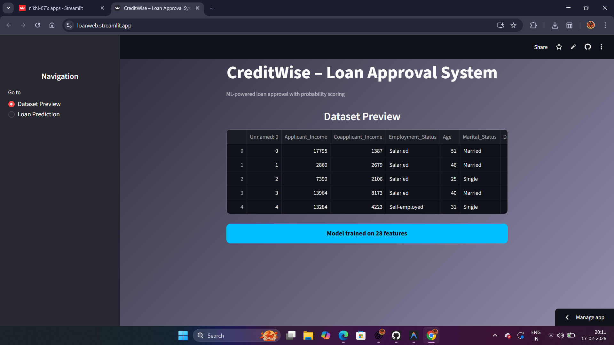
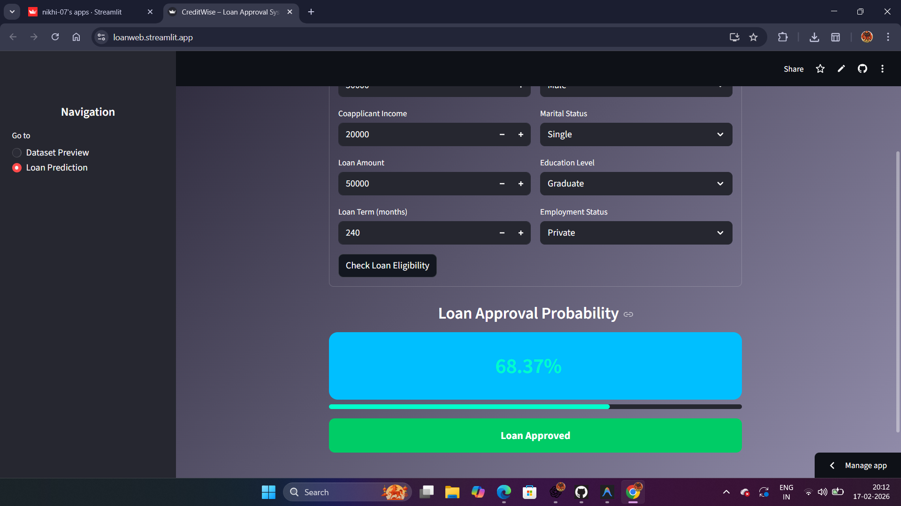
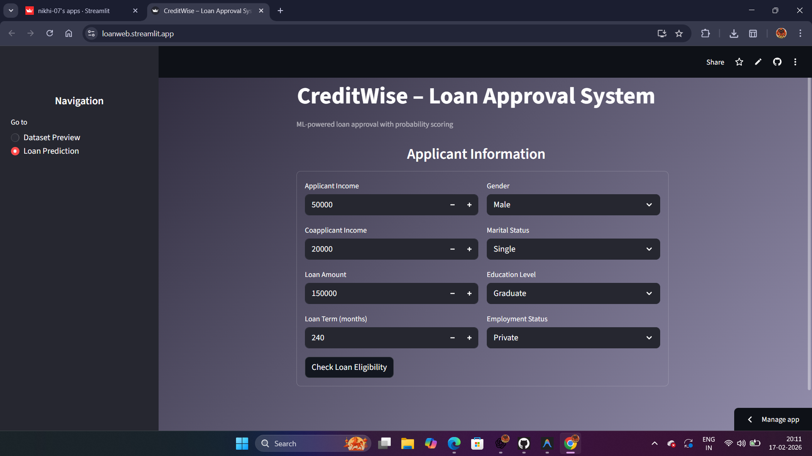
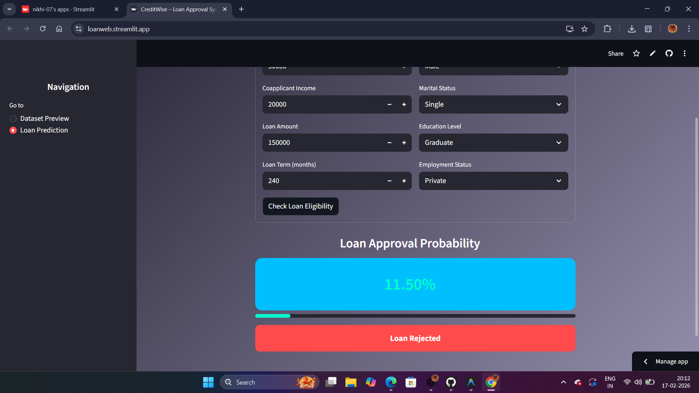

# CreditWise – Loan Approval ML System

An ML-powered web application that predicts loan approval probability using Logistic Regression.

Live App: https://loanweb.streamlit.app
 GitHub Repo: https://github.com/Nikhi-07/loan-approval-ml.git

# Features

- Real-time Loan Approval Prediction
- Probability Score Display
- Logistic Regression Model
- Automatic Data Preprocessing
- Modern Fintech UI (Streamlit)

# Tech Stack

- Python
- Streamlit
- Pandas
- NumPy
- Scikit-learn
- Logistic Regression

# Model Workflow

1. Data Cleaning
2. Feature Engineering
3. One-Hot Encoding
4. Feature Scaling
5. Logistic Regression Training
6. Probability Prediction


## 📸 Screenshots

<p align="center">
  <br><br>
  <br><br>
  <br><br>
  
</p>


# How To Run Locally

```bash
pip install -r requirements.txt
streamlit run app.py

# After Creating README

Run:

```bash
git add README.md
git commit -m "Added professional README"
git push